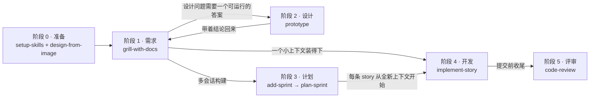
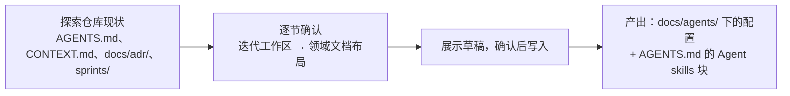
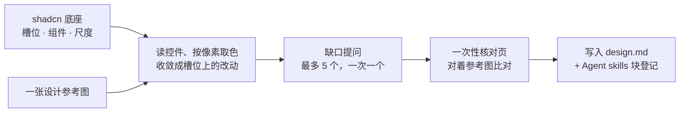
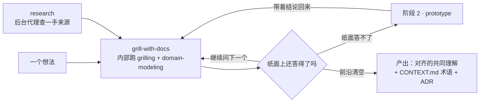
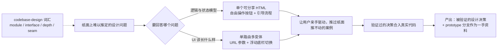
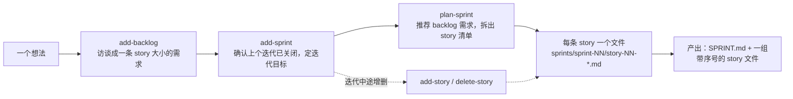
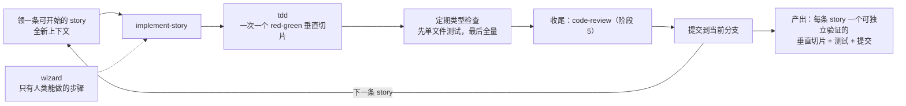
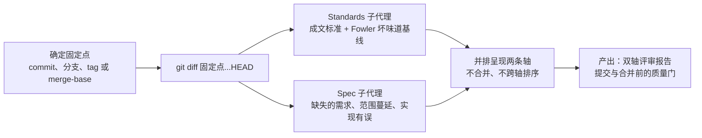
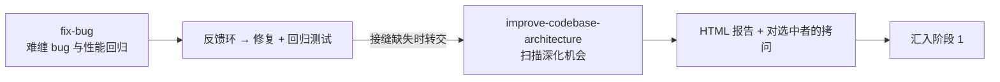

# m430 Skills

面向真实工程实践的 AI 编程技能集（中文版）。fork 自 [mattpocock/skills](https://github.com/mattpocock/skills)（MIT），全部技能文档已译成中文并按自身需要独立维护。

## 这套技能解决什么问题

AI 编码代理最常见的四个失败模式，各自对应一类技能：

1. **代理没做出你想要的**。修复方式是拷问（grilling）：让代理就你要做的东西对你展开细致追问，对齐之后再动手。见 `/grill-me` 与 `/grill-with-docs`。
2. **代理话太多**。修复方式是共享语言：一份 `CONTEXT.md` 词汇表，让代理用 1 个词说清原本要 20 个词的事。内置于 `/grill-with-docs`。
3. **代码跑不起来**。修复方式是反馈环：静态类型、浏览器访问、自动化测试，尤其 red-green-refactor。见 `/tdd` 与 `/fix-bug`。
4. **写出了一团泥球**。修复方式是每天关心代码设计。见 `/codebase-design` 与 `/improve-codebase-architecture`。

## 安装

两条路线二选一，都装会得到重复的两份技能。

### Claude Code 插件

本仓库自身即一个单插件 marketplace：

```bash
/plugin marketplace add m430/skills
```

然后在会话内：

```bash
/plugin install m430-skills@m430
```

### 其他 agent（Codex 等）：skills.sh

```bash
npx skills@latest add m430/skills
```

安装器允许挑选技能与目标 agent。**务必把 `setup-skills` 选上。**

也可以按单个技能安装：

```bash
npx skills@latest add m430/skills --skill=<name>
```

### 本地维护本仓库时

```bash
scripts/link-skills.sh
```

把技能以软链方式接入 `~/.claude/skills` 与 `~/.agents/skills`，`git pull` 即保持最新；新增、删除或重命名技能后重新运行。

## 快速开始

1. 在你的项目里运行 `/setup-skills`（每个仓库一次）：写下 `sprints/` 迭代工作区约定与领域文档位置。
2. 想到要做的事：用 `/add-backlog` 访谈梳理成一条 story 大小的需求，记进 `sprints/backlog/`。
3. 按迭代交付：`/add-sprint` 开迭代，`/plan-sprint` 拆 story，`/implement-story` 逐条实现，`/close-sprint` 收尾。

## 按阶段看技能（工作流地图）

技能组织成一条主线：一个想法被**磨锐**（需求）、**试出答案**（设计）、**排进迭代拆成 story**（计划）、**构建出来**（开发）、**检查过**（评审）。两条旁路是独立入口，产出汇入主线；另外一组技能垫在所有阶段下面。



主线上的上下文纪律：阶段 1 到 3 保持在**同一个上下文窗口**里（拆 story 前不 compact 也不 clear），让拷问、迭代目标和 story 建立在同一份思考上；每次实现从全新上下文开始，只带一条 story。

### 阶段 0 · 准备（每仓库一次）

技能：[setup-skills](./skills/engineering/setup-skills/SKILL.md)、[design-from-image](./skills/design/design-from-image/SKILL.md)



shadcn 项目还要一份设计系统：`setup-skills` 只登记约定，产物由 `design-from-image` 出。底座是 shadcn/ui，它给一张设计参考图，逐控件按像素取色（脚本直接输出 oklch）、量出字阶与间距，收敛成槽位上的改动，缺口当面问清，最后写出 `design.md`，并把块里那一节换成读文件的说法。



**产出**：一份仓库级配置（迭代产物在哪、领域文档在哪），以及 shadcn 项目的 `design.md`（在底座上改了哪些令牌与组件，每条标注是观察到、裁定、继承还是推断）。之后每个技能会话都从 `AGENTS.md` 的 `## Agent skills` 块与 `docs/agents/` 读约定；`sprints/` 是固定约定，不用配置。

### 阶段 1 · 需求（把想法磨锐）

技能：[grill-with-docs](./skills/engineering/grill-with-docs/SKILL.md)（主入口）、[grilling](./skills/productivity/grilling/SKILL.md)、[domain-modeling](./skills/engineering/domain-modeling/SKILL.md)、[research](./skills/engineering/research/SKILL.md)、[grill-me](./skills/productivity/grill-me/SKILL.md)



在某个工作目录里干活时用 `grill-with-docs`；完全没有工作目录时改用 `grill-me`（同一套访谈，无状态、不落文档）。访谈中术语敲定就写进 `CONTEXT.md`，难逆转的决定记成 ADR。`research` 的产物是这一阶段的输入。

**产出**：一棵清空的决策树（你与代理对齐的共同理解），以及 `CONTEXT.md` 的新术语与新增 ADR。

### 阶段 2 · 设计（回答纸面回答不了的问题）

技能：[prototype](./skills/design/prototype/SKILL.md)、[codebase-design](./skills/engineering/codebase-design/SKILL.md)



这是主线上的一次**绕道**，不是必经步骤：拷问中遇到“必须跑一下才知道”的问题（状态模型手感、UI 长相）时才进入，答案带回阶段 1。模块与接口形状本身存疑时，用 `codebase-design` 的词汇把问题说准。

**产出**：被验证的设计决策（合入真实代码或写进规格）；原型本身提交到 `prototype/<name>` 分支，作为一手资料由后续实现参考。

### 阶段 3 · 计划（迭代与 story）

技能：[add-backlog](./skills/engineering/add-backlog/SKILL.md)、[add-sprint](./skills/engineering/add-sprint/SKILL.md)、[plan-sprint](./skills/engineering/plan-sprint/SKILL.md)、[add-story](./skills/engineering/add-story/SKILL.md)、[delete-story](./skills/engineering/delete-story/SKILL.md)



只有**多会话的构建**需要这一步；一个上下文装得下的小改动从阶段 1 直接进阶段 4。需求先进 `sprints/backlog/`：`add-backlog` 把想法访谈到一条 story 大小的粒度（一条一个文件，不编号，验收意图与边界写清楚），开迭代时定目标，再按目标从 backlog 推荐需求、拆成 story：每条是垂直切片，自带验收标准与任务清单，声明被谁阻塞。

**产出**：一份 `SPRINT.md`（迭代目标与 story 清单）和一组 `sprints/sprint-NN/story-NN-*.md`。此后逐条推进：阻塞者已完成的 story 就可以领走。

### 阶段 4 · 开发（逐条 story 实现）

技能：[implement-story](./skills/engineering/implement-story/SKILL.md)、[tdd](./skills/engineering/tdd/SKILL.md)、[wizard](./skills/engineering/wizard/SKILL.md)



每条 story 自包含：实现完一条 `/clear`，再领下一条。测试只在**预先约定的接缝**上写。撞上只有人类能做的步骤（开通服务、配置凭据）时，让 `wizard` 生成一个交互式 bash 向导。

**产出**：每条 story 一个可独立验证的垂直切片：可运行的行为、通过的测试、可追溯的提交。

### 阶段 5 · 评审（双轴验收）

技能：[code-review](./skills/engineering/code-review/SKILL.md)



`implement-story` 在提交前自动进这一阶段收尾；也可以对任意分支或 PR 独立运行（给一个固定点即可）。两条轴在并行子代理里跑，互不污染上下文：**Standards** 查代码是否遵循仓库标准，**Spec** 查代码是否忠实实现了源 story 或规格。

**产出**：两条轴分开的评审报告（每条轴的发现数与最严重项），作为提交或合并前的质量门。

### 旁路（独立入口，产出汇入主线）



- **[fix-bug](./skills/engineering/fix-bug/SKILL.md)**：难 bug 与性能回归。拿到紧凑的反馈循环之前拒绝空谈理论。**产出**：修复、回归测试，以及被证实正确的假设（写进提交消息）。发现没有可锁死 bug 的接缝时，转交 `improve-codebase-architecture`。有进行中的迭代时，它把 bug 记成 `sprints/sprint-NN/bug-NN-*.md` 并回填 `SPRINT.md` 的缺陷清单，迭代里因此能同时看到需求和 bug。
- **[improve-codebase-architecture](./skills/engineering/improve-codebase-architecture/SKILL.md)**：代码库保养。**产出**：深化机会报告；选中一个就生成想法，从阶段 1 进入主线。

### 贯穿与独立技能

| 技能 | 什么时候用 |
|---|---|
| [grilling](./skills/productivity/grilling/SKILL.md) | 访谈原语本身：一次一个问题，事实归代理查、决定归你拍板。`grill-me`、`grill-with-docs`、`improve-codebase-architecture` 内部都在跑它 |
| [domain-modeling](./skills/engineering/domain-modeling/SKILL.md) | 领域词汇的维护纪律：挑战模糊术语，当场更新 `CONTEXT.md`，适时记 ADR |
| [codebase-design](./skills/engineering/codebase-design/SKILL.md) | 深模块词汇（module、interface、depth、seam、adapter、leverage、locality），任何设计或评审接口与接缝的场合 |
| [grill-me](./skills/productivity/grill-me/SKILL.md) | 不在任何工作目录里干活时的访谈入口：同一套访谈，无状态 |

## 技能参考

按"谁能调用"分两类。**User-invoked** 只能由你输入斜杠命令触发，负责编排流程；**Model-invoked** 可被你调用，也可由代理在任务匹配时自动触发，承载可复用的纪律。User-invoked 技能可以调用 Model-invoked 技能，反之不行。

### Design

界面与设计系统相关的工作。

**User-invoked**

- **[design-from-image](./skills/design/design-from-image/SKILL.md)**: 在 shadcn/ui 底座上，按一张设计参考图改出项目级设计系统，写出仓库根目录的 `design.md`：令牌收敛到 shadcn 的槽位、颜色由脚本按像素采样并直接给出 oklch、每条标注观察到 / 裁定 / 继承 / 推断，沿用底座的组件体系而不是另造一套。每个 shadcn 项目运行一次。

**Model-invoked**

- **[prototype](./skills/design/prototype/SKILL.md)**: 构建一次性原型回答设计问题：状态/逻辑问题用单个可分享 HTML 文件，UI 问题用一条路由可切换的多个差异巨大的变体。

### Engineering

日常代码工作使用。

**User-invoked**

- **[grill-with-docs](./skills/engineering/grill-with-docs/SKILL.md)**: 拷问式访谈，同时构建项目领域模型，现场打磨术语并更新 `CONTEXT.md` 与 ADR。
- **[add-backlog](./skills/engineering/add-backlog/SKILL.md)**: 把讨论里冒出来的想法用拷问式访谈梳理成一条待规划需求，写进 `sprints/backlog/`；粒度控制在一条 story，不编号，不归属任何迭代。
- **[add-sprint](./skills/engineering/add-sprint/SKILL.md)**: 开启一个新迭代：确认上一个已关闭，问清迭代目标，初始化 `sprints/sprint-NN/` 与 `SPRINT.md`。
- **[plan-sprint](./skills/engineering/plan-sprint/SKILL.md)**: 按迭代目标推荐 backlog 里的相关需求，拆出 story 清单经你确认后，为每条生成带序号的 story 文件。
- **[add-story](./skills/engineering/add-story/SKILL.md)**: 给当前迭代补一条 story，同步更新 `SPRINT.md`。
- **[delete-story](./skills/engineering/delete-story/SKILL.md)**: 从当前迭代删掉一条 story，同步清理 `SPRINT.md` 与其他 story 里指向它的阻塞边。
- **[implement-story](./skills/engineering/implement-story/SKILL.md)**: 实现一条 story，在预先约定的接缝（seam）驱动 `/tdd`，收尾跑 `/code-review` 后提交，完成后更新 story 状态。
- **[close-sprint](./skills/engineering/close-sprint/SKILL.md)**: 评估迭代完成情况并写入 `SPRINT.md`，关闭迭代；未完成的 story 逐条定好去向。
- **[improve-codebase-architecture](./skills/engineering/improve-codebase-architecture/SKILL.md)**: 扫描代码库寻找深化机会，以可视化 HTML 报告呈现，选定后进入拷问循环。
- **[setup-skills](./skills/engineering/setup-skills/SKILL.md)**: 为本仓库配置工程技能（迭代工作区约定、领域文档布局，shadcn 项目还登记设计系统）。使用其他工程技能前每仓库运行一次。

**Model-invoked**

- **[fix-bug](./skills/engineering/fix-bug/SKILL.md)**: 硬 bug 与性能回归的纪律化诊断环：建一条对该 bug 变红的反馈环，最小化，列假设，插桩，修复，回归测试；有进行中的迭代时把 bug 记进 `sprints/sprint-NN/`，迭代里能同时看到需求和 bug。
- **[research](./skills/engineering/research/SKILL.md)**: 以后台代理按高可信一手来源调研问题，把结论沉淀为仓库中带引用的 Markdown 文件。
- **[tdd](./skills/engineering/tdd/SKILL.md)**: 测试驱动开发，red-green-refactor 循环，一次一个垂直切片地构建功能或修复 bug。
- **[domain-modeling](./skills/engineering/domain-modeling/SKILL.md)**: 主动构建并打磨项目领域模型：对照词汇表挑战术语，用边界场景压测，当场更新 `CONTEXT.md` 与 ADR。
- **[codebase-design](./skills/engineering/codebase-design/SKILL.md)**: 设计深模块的共享纪律与词汇：小接口背后藏大量行为，落在干净的接缝上，经由接口可测。
- **[code-review](./skills/engineering/code-review/SKILL.md)**: 对固定点以来的 diff 做双轴评审：Standards（仓库编码标准加 Fowler 坏味道基线）与 Spec（是否忠实实现来源 story/规格），以并行子代理运行互不污染。
- **[wizard](./skills/engineering/wizard/SKILL.md)**: 生成交互式 bash 向导，引导人类完成只有他们能做的步骤：开通基础设施、配置凭据或 CI secrets、走不熟悉的第三方后台、执行一次性迁移。

### Productivity

通用工作流工具，不限于代码。

**User-invoked**

- **[grill-me](./skills/productivity/grill-me/SKILL.md)**: 就一个计划或设计被毫不松口地访谈，直到设计树的每条分支都解决。

**Model-invoked**

- **[grilling](./skills/productivity/grilling/SKILL.md)**: 就计划、决策或想法对用户毫不松口地访谈，直到设计树每条分支解决。`grill-me`、`grill-with-docs`、`improve-codebase-architecture` 背后可复用的访谈原语。

## 致谢

本仓库 fork 自 [Matt Pocock 的 skills 仓库](https://github.com/mattpocock/skills)，原项目以 MIT 许可发布，感谢其出色的工程实践沉淀。
